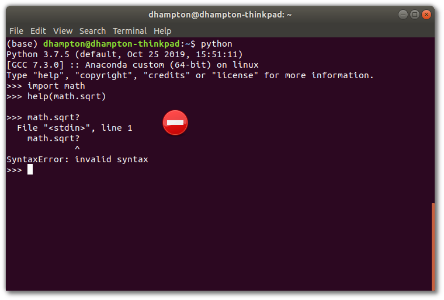
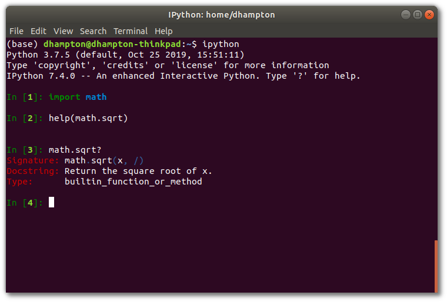
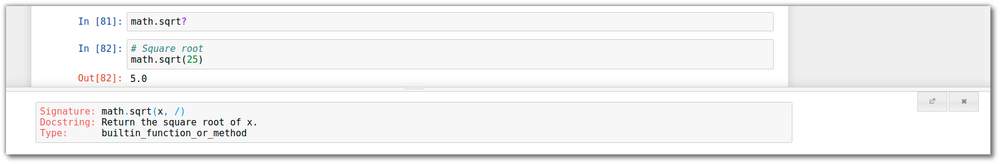
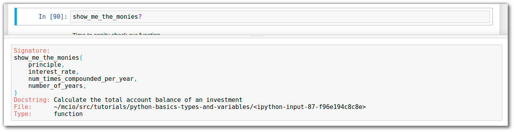
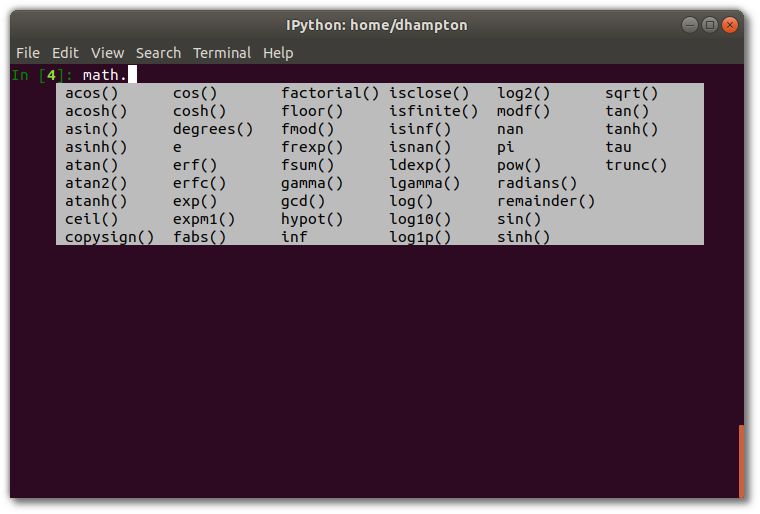

<ArticleTitle />
<TagLinks />

Today we're going to take a tour of basic Python data types and how to assign
them to variables. We will discover integers, floats, and more. Learn
how to use them effectively with the interactive interpreter and Jupyter
Notebooks.

<!-- more -->
<YouTube videoUrl="https://youtu.be/6VB6vG-tRyQ" />

This tutorial assumes you have at least Python 3.6 installed. You can watch this
video on
[Getting Started with Python](https://modercoder.io/getting-started-with-python)
on how to get up and running.

::: tip Note 

In the regular article of this tutorial, the code entered into the
interpreter is shown in code blocks marked with `py` in the upper right. The
output is displayed in a code block immediately below, without the `py` marker.

You can view the `notebook` version of this article on
[GitHub](https://github.com/dhampton084/mcio/blob/master/src/tutorials/python-basics-numbers-and-functions/python-basics-numbers-and-functions.ipynb)

You can also download the notebook and run it on your machine by
[cloning the repository](https://help.github.com/en/github/creating-cloning-and-archiving-repositories/cloning-a-repository).
:::

If you installed Python through Anaconda `ipython` and `jupyter` are already
installed. However, they can also be easily added for free from any Python
installation. Use these commands in your terminal or command prompt:
```
pip install ipython
pip install jupyter
```


Some topics we will introduce in this article:

* numbers
  * integers
  * floats
* math operations
* variables
* functions
* the `help()` command
* importing additional tools
* checking types

## Using Python as a Calculator
You can use Python just as you would a calculator. This may be an extreme
approach to calculating a tip, but it's the simplest interaction to start with.
You can add, subtract, multiply, and divide numbers with ease. We will build on
these basics.

::: tip

You can add comments to your code by using the `#` symbol. Anything after `#` on
the is just a note for you the reader and will not be executed as code.

`# This is not considered code`

:::


```python
# Addition
5 + 10
```


    15


```python
# Subtraction
10 - 3
```


    7


```python
# Multiplication
4 * 3
```


    12


```python
# Division
20 / 2
```


    10.0


Notice that last one? `10.0` instead of `10`. We'll cover this more in just a
bit, but the division operator `/` will always return a number with a decimal,
called a **float**, rather than a whole number, called an **integer**. There's
another division operator for **floor division** that always returns the whole
number part.


```python
# Floor Division
20 // 3
```


    6


```python
# Exponentials
5 ** 2
```


    25


Remainders from division can be calculated using the **modulo** operator `%`.
Yes, I just called it a percent sign too. 😎 So we can stay cool.


```python
# Remainder
10 % 4
```


    2


We can use parentheses `( )` to form more complicated expressions and control
the order of operations.


```python
# A more complex expression
3 * (5 + 3)
```


    24


```python
# A more more complex expression
(3 * ((5 % 2) * 3)) + 1
```


    10


## Intro to Variables

> What if I want to store the result of my calculation to use later?

Great question! 💯 

We can store our hard-earned result in a **variable**.


```python
# Variable assignment
x = 2
```


```python
x
```


    2


`x` equals 2? Not exactly. The `=` operator is the **assignment** operator.
There is another operator for *equality* `==` that compares two values, which we
will cover in another tutorial.

The *assignment* operator says: give the *variable*, which we named `x`, the
*value* of `2`. Now, wherever we use variable `x` it will be as if we typed `2`
instead.


```python
x + 3
```


    5


```python
x + x + x
```


    6


You get the idea. 

### Naming Variables

You can name a variable whatever you like, as long as it doesn't start with a
number or contain certain special characters, like spaces or quotes. For
example:

**OK:**

* `my_variable`
* `important_variable6`
* `_moose`
* `BIG_CAT`
* `smallDog`

**WON'T WORK:**

* `no spaces`
* `"airquotesbad"`
* `99numbersCantGoFirst`

Let's store the value for that more complicated expression


```python
# Give the variable named 'my_important_result' the value of the expression.
my_important_result = (3 * ((5 % 2) * 3)) + 1
```


```python
my_important_result
```


    10


To recap, the pattern looks like this:

|variable name|assignment operator|expression|
|:-----:|:-----:|:-----:|
|my_important_result|=| (3 * ((5 % 2) * 3)) + 1 |
|x|=|2|
|y|=| x + x + 3 |


You can *reassign* variables. Later uses of the variable will now use the new
value, instead of the old


```python
my_important_result = 200
```


```python
my_important_result + my_important_result
```


    400


## Intro to Functions

> I don't want to type these complicated expressions all the time. How can I
> resuse my important calculations over and over again?

Great question! 🥇 

Let's introduce the idea of **functions**. Similar to how *variables* can store
*values* for repeated use, functions can store *logic* for repeated use. Use the
keyword `def` to **define** a function.


```python
def save_my_logic():
    return 2 * 8
```

Notice the `()` in the function definition? They're important. Now we can
**call** the function with this pattern: `function_name()`.


```python
save_my_logic()
```


    16


Notice the `return` keyword in our function definition? The function can have
any number of steps, but you will probably want to get back some value from your
important calculation. So we need to tell it to `return` that value. It'll make
more sense if we add a few more steps.


```python
def save_my_logic():
    x = 3
    y = 4
    return x * y
```


```python
save_my_logic()
```


    12


Incredible! You can see we were able to assign values to variables within our
function, and return something specific, in this case the product of `x` and
`y`. Now you can use this function as many times as you want and it will repeat
those steps for you.


```python
new_variable = save_my_logic() * save_my_logic() + save_my_logic()
```


```python
new_variable
```


    156


### Add a Docstring to Help

Let's add some help text, or a **docstring** to our function to remind us what
it does.


```python
def save_my_logic():
    """Multiplies 3 by 4"""
    x = 3
    y = 4
    return x * y
```

This docstring is a comment (not executed as code) that tells you or future
users of your function what it does. Documentation is important in programming.
Programmers at all skill levels write and use documentation, even for your own
code. It isn't easy to remember what you were trying to do 6 months ago!

Here's one way to access the docstring of our function:


```python
help(save_my_logic)
```

    Help on function save_my_logic in module __main__:
    
    save_my_logic()
        Multiplies 3 by 4
    


Whoa, where did that `help` thing come from? It's just another function. One
that is built into Python that tells you what a function does. Notice the
parentheses in `help(our_function_name)`? This is another instance of *calling*
a function. But this time there's something *inside* the parentheses. That means
we are passing something as an **argument** into the function, which the
function will then use.

### Arguments and Parameters

An argument can be nearly any object. Values, variables, even *other functions*
can be arguments! Notice how we passed `save_my_logic`, which is a function we
made, into the `help` function. We did **not** use `save_my_logic()`, with the
parentheses, which would have called the function and executed it's code,
returning the value `12`. In this case, we just passed the function *itself*. The
`help` function then reads the docstring we created and displays that
information to us. We can use `help(function_name)` on any function. Even `help`
itself! 🤯


```python
help(help)  # You can call help on help!
```

    Help on _Helper in module _sitebuiltins object:
    
    class _Helper(builtins.object)
     |  Define the builtin 'help'.
     |  
     |  This is a wrapper around pydoc.help that provides a helpful message
     |  when 'help' is typed at the Python interactive prompt.
     |  
     |  Calling help() at the Python prompt starts an interactive help session.
     |  Calling help(thing) prints help for the python object 'thing'.
     |  
     |  Methods defined here:
     |  
     |  __call__(self, *args, **kwds)
     |      Call self as a function.
     |  
     |  __repr__(self)
     |      Return repr(self).
     |  
     |  ----------------------------------------------------------------------
     |  Data descriptors defined here:
     |  
     |  __dict__
     |      dictionary for instance variables (if defined)
     |  
     |  __weakref__
     |      list of weak references to the object (if defined)
    


### Help Shortcut

There's a shortcut to getting documentation help. Put a question mark at the end
of the function: `function_name?`

If you're using the regular `python` interactive prompt. You have to use the
`help()` function.


But if you are using `ipython` or a `jupyter notebook` you can use the question
mark shortcut. 




### Adding Parameters

> Wait just a moment. Can I have arguments in my own functions, so I can repeat
> the important calculations with different numbers?

Great question! 🎱 

Yes, you can. Let's make it so `save_my_logic` can take arguments.


```python
def save_my_logic(x, y):
    """Multiplies x by y"""

    return x * y
```

We have updated our function definition so `x` and `y` are no longer hardcoded
inside the function. They've been moved to within the parentheses of our
function definition. `x` and `y` are now called **parameters**. You can think of
parameters as the placeholders for values that will be used when the function is
eventually *called*.

For example, in this code snippet `a`, `b`, `c` are the function **parameters**
and `x`, `y`, `z` are the **arguments** being passed into the function when it
is used.

```python
def my_function_name(a, b, c):
    return a + b + c
    
x = 2
y = 4
z = 8

my_function_name(x, y, z)
```


Let's use our updated function.


```python
save_my_logic(2, 4)
```


    8


```python
# remember you can name variables whatever you want
cats = 3
dogs = 6
save_my_logic(cats, dogs)
```


    18


## A Real Example

> All well and good, but how about a useful example instead of just adding and
> multiplying random numbers?

Great question! 💰 

Let's make a financial formula. Everyone loves money 💵.

Calculating compound interest of an investment:

$$A=P \left( 1+\frac{r}{n} \right) ^{n*t}$$

But we can make this more readable:

$$account\_total = principle \left( 1+\frac{interest\_rate}{num\_times\_compounded\_per\_year} \right) ^{num\_times\_compounded\_per\_year * number\_of\_years}$$

Let's build this equation as a Python function with our easy to understand
variable names.


```python
def show_me_the_monies(principle, interest_rate, num_times_compounded_per_year, number_of_years):
    """Calculate the total account balance of an investment"""
    
    account_total = principle * (1 + (interest_rate / num_times_compounded_per_year)) ** (num_times_compounded_per_year * number_of_years)
    
    return account_total
```

Whew 😅. 

Glad we don't have to type that out every time we want to do this calculation.
Let's see this function in use.


```python
# Set up our input data. The names of these variables do not have to match the function parameters names.
# But it's easier to follow this way.

principle = 500  # Dollars!
interest_rate = 0.05  # 5% expressed as a decimal
num_times_compounded_per_year = 1  # compounded annually, start simple.
number_of_years = 1  # start off with just a year, start simple.

show_me_the_monies(principle, interest_rate, num_times_compounded_per_year, number_of_years)
```


    525.0


It works! 

The order of the arguments passed into the function is important. If we forget
the order we defined in our function, we can call on the documentation help.



Time to sanity check our function. We expect \\$500 to be \\$525 after a year of
growth a 5% a year (we said it is compounded once per year in the example)


```python
500 * 1.05
```


    525.0


Looks like it's working as it should.

How does it change if we compound it monthly? Easy to check!


```python
num_times_compounded_per_year = 12  # changed to compound monthly
show_me_the_monies(principle, interest_rate, num_times_compounded_per_year, number_of_years)
```


    525.5809489408665


Not a huge difference. Let's see what it would be after 2 or 3 years of investment!


```python
number_of_years = 2
show_me_the_monies(principle, interest_rate, num_times_compounded_per_year, number_of_years)
```


    552.4706677791635


```python
number_of_years = 3
show_me_the_monies(principle, interest_rate, num_times_compounded_per_year, number_of_years)
```


    580.7361156667339


There we have it. A useful example. With functions, you can reuse complex logic and easily change the inputs.

## Intro to Imports

> What if I want to do some fancier math with my Python powered über calculator?

Great question! 👽 

To do this, let's bring in some extra math tools (less dangerous than hammers)
to help out, using what is called an **import statement**.


```python
import math
```

What did that just do? It brought in the
[math](https://docs.python.org/3/library/math.html) library, which is built into
Python. This provides us with those aforementioned extra tools 🔨. You can
import any built-in library, or you've installed with `pip`, by using
the `import` keyword, followed by the name of the library. `import os` for example,
to bring in more tools for working with the operating system.

Let's use the math tools we just imported. You do this by *calling* the
**method** on the `math` object we just imported.


```python
# Square root method
math.sqrt(25)
```


    5.0


We imported the library named `math` and called the square root method `.sqrt()`
with the number `25` passed to that method. A method is just a function that is
part of an object. Almost everything in Python is an object, so it's a very
general term. In this case, the imported library `math` is our object, and the
method is `.sqrt`. We *access* this method using the dot `.` notation. So a
general form would be `my_object.method_name()` would call `method_name` on
`my_object`.

Remember you can check what a method does by using `help()` or `?`. For example:
`math.sqrt?` would show the documentation for the `sqrt` method.

### Tab-Completion

>How do I know what other tools are in the `math` library? 

Great question! 🛠

One way to find out is to look at the official Python
[documentation for the library](https://docs.python.org/3/library/math.html).

An often easier way is to use **tab-completion** available in `ipython`,
`jupyter notebooks` and most IDEs or code editors. If you type `math.` (note the
`.`) and hit `TAB` on your keyboard, it will show available methods in the
`math` library. 

Tab completion can also be used to complete variables or functions calls.

For example, typing `save_my` then hitting `TAB` will autocomplete to
`save_my_logic` because we defined it earlier in our code.

Notice some of the suggestions don't have parentheses. These are not methods,
but properties that represent a value. Such as the constant pi.


```python
math.pi
```


    3.141592653589793


```python
# Sine of 90 degrees. We're calling the 'sin' method and using the constant 'pi'.
math.sin(math.pi / 2)
```


    1.0


### Import Namespacing

> What if I don't like typing `math` all the time to use `pi` or `sqrt`?

Great... question? 🆒

The solution is the awesome power of **namespacing**. Behold:


```python
import math as m
```

We have created an alias for `math` called `m`. When we use `m` we are referring
to the `math` library. Namespacing just means all our `math` methods are
contained within the `math` or `m` namespace and must be accessed with the dot
notation. `math.sqrt()` or `m.sqrt()`.

If two libraries had a function with the same name, let's say `calculate`, using
namespacing avoids potential conflicts. `blue.calculate()` and `red.calculate()`
refer to two different functions, both named `calculate` but one from
the `blue` library and another from the `red` library.


```python
m.pi
```


    3.141592653589793


```python
m.sqrt(25)
```


    5.0


Are you not entertained?

### From and All Imports

>What if I don't like typing `m` all the time?

... 🦍

Got you covered. If you just want to import `pi` and `sqrt` you can do this:


```python
from math import pi, sqrt
```

This only imports the constant `pi` and the method `sqrt` from the `math`
library. You can then use these directly without having to type `math` or `m`.


```python
sqrt(25)
```


    5.0


```python
pi
```


    3.141592653589793


This is perfectly fine, as you are explicitly importing `pi` and `sqrt` and it's
obvious where they come from. Now let's look at something we should generally
avoid.


```python
from math import *
```

This imports *everything* from `math` into our local namespace. This has the
potential to overwrite other methods or values in our local namespace, causing
potential confusion and bugs. I would suggest avoiding this approach to keep
things clear and readable, even if it saves a few keystrokes in the short term.


```python
# If I'm just reading this code, how do I know where `sin` and `pi` come from?
sin(pi/2)
```


    1.0


## Intro to Types

We have kept it simple in this tutorial by only working with numbers. There are
many more data types in Python, but before we get there, let's briefly introduce
the *concept* of types using the built-in `type()` function.

What are the **types** of the numbers we have been using?


```python
type(2)
```


    int


```python
type(2.0)
```


    float


You can see Python thinks there is a difference between `2` and `2.0`. To review
what was mentioned earlier, the whole number is an **integer** and the decimal
number is called a **float** in Python. Otherwise known as a floating-point
value or a **double** in other programming languages.


```python
type(save_my_logic)
```


    function


Here we see that `function` is also a type! 


```python
type(math.sqrt)
```


    builtin_function_or_method


```python
type(math.pi)
```


    float


Interestingly, the built-ins look like they have a different type, but `pi` is a
float as we would expect.


```python
x = 2 + 2
```

When we add two integers we expect the result to be an integer.


```python
type(x)
```


    int


And we are correct. What happens if you add an integer with a float?


```python
x = 2 + 2.0
```


```python
type(x)
```


    float


Notice here that Python automatically converts our integers to floats so the
expression can evaluate. The result is then also a float.

You can manually convert a value between two types where conversion is possible.


```python
float(2)
```


    2.0


```python
int(2.0)
```


    2


```python
int(2.1)
```


    2


Notice when converting from a float to an integer we lost the information after
the decimal.

What happens when we try to convert incompatible types?


```python
int(save_my_logic)
```


    ---------------------------------------------------------------------------

    TypeError                                 Traceback (most recent call last)

    <ipython-input-64-f08490dbb4cc> in <module>
    ----> 1 int(save_my_logic)
    

    TypeError: int() argument must be a string, a bytes-like object or a number, not 'function'


```python
save_my_logic + 2
```


    ---------------------------------------------------------------------------

    TypeError                                 Traceback (most recent call last)

    <ipython-input-65-007dd7b9fc11> in <module>
    ----> 1 save_my_logic + 2
    

    TypeError: unsupported operand type(s) for +: 'function' and 'int'


A **TypeError** 😱😱😱! 

No worries, Python is just letting us know we can't do what we thought we could.

The important thing to know at this point is that values have types, and you can
check them using the `type()` function. You can also convert between types, and
certain operations like division or performing operations between floats and
integers will automatically convert types for you if possible.

## Review

That is going to conclude this tutorial, let's review what we've accomplished:

* Used Python as a simple calculator with numbers and math operations.
* Stored results of expressions in variables for reuse.
* Stored logic for reuse by creating our own function.
* Made a Python function for a financial equation using easy to read variable names.
* Learned how to access help documentation for any function.
* Learned how to import additional tools (libraries or packages) for our use in Python.
* Learned how to check an object's type, such as ints, floats, or functions.

## What's Next

In a future tutorial, we're going to look at more basic Python data types, such
as strings and booleans. We'll introduce the `print` function and logical
operators for comparing values.

If you want to know when the next tutorial is published, you can follow me on
Twitter [@DanCanDoTV](http://bit.ly/2bFrvtA) or subscribe to the
[YouTube channel DanCanDo](https://www.youtube.com/channel/UCb8RK2cBQl9X-l3TEVuT2Gg)
where the videos are hosted.

## Zen of Python

Try entering this into your Python terminal:

```python
import this
```
