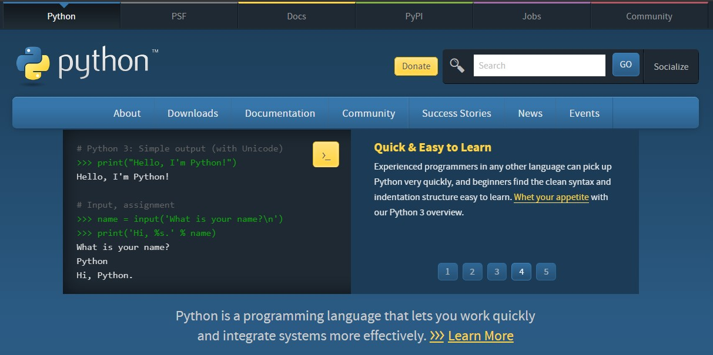
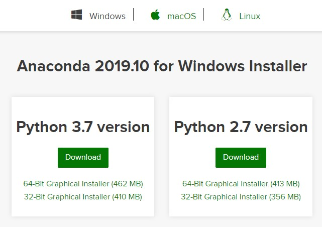

<ArticleTitle />
<TagLinks />

Welcome friends! Maybe you've come here after reading about this fancy *machine
learning* stuff. Or you've heard that coding is a superpower that will help you
launch a new career. Either way, you're probably asking yourself, "Where do I
start?". Right here in this tutorial, with no previous programming knowledge
required! We are going to learn how to download and install python. Then we will
create our development environment to make working with code fun and easy. Let's
get started!

<!-- more -->

## Download and Install Python

There are two ways we're going to cover downloading Python. The first is to get
it directly from [python.org](https://python.org). This is a more bare-bones
setup if you want to start from a mostly blank slate. The second option is
downloading through [Anaconda](https://anaconda.com) and is the approach I recommend.
This is a "batteries included" way of installing python. This distribution
contains not only python but many useful libraries and pieces of software. Great
for getting a jump-start and browsing what sort of tools are out there.

### Installing from Python.org

Head over to python.org and click on the **Downloads** section.

Here you'll be able to download the installer for your operating system.
The latest version at the time of this writing is 3.8.

::: tip A Note on Python Versions
You're going to want the 3.X version of python. 2.X versions are not being
supported any longer and you should avoid them unless you have a very specific
reason.
:::

Windows and Mac OS X have installers. Just download them and follow the prompts.
If you're on Linux you'll have to build from source code. Or you can use the
easier Anaconda distribution. See the
[section below](#installing-from-anaconda).

### Installing from Anaconda

You can use [this link](https://www.anaconda.com/distribution/#download-section)
to go directly to the download section for Anaconda.

This time installers are provided for Windows, macOS, and Linux. Again, you'll
want to get the 3.X version. You may notice the python version here doesn't
match the latest version from python.org. That's okay! Anaconda is bundled to
make sure all the dependencies work together well. You can still use the latest
version python with Anaconda by creating a clean **virtual environment**, which
we will discuss briefly later.

The downside is that the installation file is large and make take a little
longer to install.

The key packages and software this includes that make getting started easier
are:

* **`ipython`** - An improved python terminal.
* **`jupyter`** - A notebook-style way to write and save your code. Great for learning!
* **`spyder`** - A code editor / IDE that has a very useful variable explorer.
* **`numpy`** - A library for doing matrix math.
* **`pandas`** - A library for working with table data.
* **`matplotlib`** - A library for creating charts and graphs.

## Set Up Your Code Editor

The code editor is where you'll write the text files that make up your programs.
You could write code in a plain text file without any fancy editors, but they
include many useful features like code highlighting, hints, error messages, and
quick access to documentation. Finding an editor you're happy with will save you
a lot of time and can help you learn how to write better code.

All of the editors listed here are available for free.

### Spyder (Recommended)

Spyder is included in the Anaconda distribution and might be the easiest way to
get started right away. If you've used MATLAB before the layout should be very
familiar. The default layout includes a file editor, a python terminal, and a
very handy variable explorer. Perfect for learning! This is my recommended
choice for those beginners who just want to get started. VS Code is another
great choice.

### VS Code

VS Code, or Visual Studio Code, is a very popular (and FREE!) code editor that is extremely
customizable through its huge extensions ecosystem. It doesn't have all the
bells and whistles out of the box, but when you're just starting that can
help you from becoming overwhelmed. Be sure to add the python extension for
syntax highlighting in your python files. You will likely get a prompt to add it
once you save your first `.py` file.

You can [download VS Code here](https://code.visualstudio.com/download).

You can access the terminal or command prompt from within VS Code. Type in
`ipython` and you've got a file editor and python terminal in one.

### PyCharm Community Edition

I'm a huge fan of the IDEs (Integrated Development Environment) from JetBrains.
So much that I happily pay for PyCharm Professional to get some extra features.
But they offer a free community edition that is fantastic. I find the settings
and menus easier the navigate than the ones in VS Code, and I prefer the
shortcuts and keybindings in PyCharm, but that's an easy fix with extensions.
Debugger, test runners, notebooks and more are easy to find and access if you
want those features. PyCharm CE and Spyder are what I used when I first started
learning to code.

You can [download PyCharm here](https://www.jetbrains.com/pycharm/download/).

### IDLE

If you chose to install python directly from python.org it will come with a
minimalist editor called IDLE. You can use this if you want, but I would
recommend going with VS Code if you want something simple, light, and fast. You
can add more features later and VS Code looks great!

## A Quick Note on Virtual Environments

## What's Next

Be sure to check out the other tutorials on this site.
