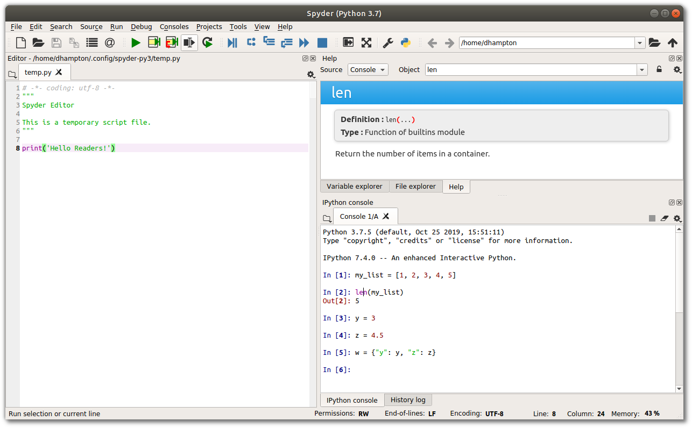

<ArticleTitle />
<TagLinks />

Let's learn how to download, install, and create your development environment to
get started programming with python! Perhaps you've heard that coding is a
superpower. Or you've read about this fancy *machine learning* stuff going
around. Either way, you're probably asking yourself, "Where do I start?". Right
here in this tutorial, with no previous programming knowledge required! Let's
get started!

<!-- more -->

## Download and Install Python

There are two ways we're going to cover downloading Python. The first is to get
it directly from [python.org](https://python.org). This is a more bare-bones
setup if you want to start from a blank slate with the built-in libraries. The
second option is downloading a python *distribution* from
[Anaconda](https://anaconda.com) and is the approach I recommend. This
"batteries included" way of installing python gives you access to many tools
that will make getting started easier. In particular, it includes great code
editors such as *jupyter notebooks* and *spyder*.

### Installing from Python.org

Head over to python.org and click on the **Downloads** section.


Here you'll be able to download the installer for your operating system.
The latest version at the time of this writing is 3.8.

::: tip A Note on Python Versions
You're going to want the 3.X version of python. 2.X versions are not being
supported any longer and you should avoid them unless you have a very specific
reason.
:::

Windows and Mac OS X have installers. Just download them and follow the prompts.
If you're on Linux you'll have to build from source code. Or you can use the
easier Anaconda distribution. See the
[section below](#installing-from-anaconda).

During installation, you will want to check the box that adds python to your
system path. This will allow us to run commands from the
terminal or command prompt like so:

```
python --version
Python 3.8.1
```


### Installing from Anaconda

You can use [this link](https://www.anaconda.com/distribution/#download-section)
to go directly to the download section for Anaconda.


This time installers are provided for Windows, macOS, and Linux. Again, you'll
want to get the 3.X version. You may notice the python version here doesn't
match the latest version from python.org. That's okay! Anaconda is bundled to
make sure all the dependencies work together well. You can still use the latest
version python with Anaconda by creating a clean **virtual environment**, which
we will discuss briefly later.

The downside is the installation file is large and make take a little
longer to install.

The key packages and software this includes that make getting started easier
are:

* **`ipython`** - An improved python terminal.
* **`jupyter`** - A notebook-style way to write and save your code. Great for learning!
* **`spyder`** - A code editor / IDE that has a very useful variable explorer.
* **`numpy`** - A library for doing matrix math.
* **`pandas`** - A library for working with table data.
* **`matplotlib`** - A library for creating charts and graphs.

During the installation process, you will want to check the box that adds
anaconda/python to your system path. Allowing us to use python commands in the
terminal or command prompt.
```
python --version
Python 3.7.4
```


### Check Your Installation Works

Whether you chose to install from python.org or anaconda, you can see if
everything installed the way it should by running the command `python --version`
in your terminal.

Included with python is a package manager called `pip`. Let's also
check that it is included.
```
pip --version
pip 19.2.3 from C:\Users\paperspace\Anaconda3\lib\site-packages\pip (python 3.7) 
```

If everything is working you can now use `pip` to install any library from the
[python package index](https://pypi.org/)! A huge repository of software for
python. For example, if you installed from python.org and want to use *jupyter
notebooks* you can use this command:
```
pip install jupyter
```

### Pip vs Conda

`pip` comes with python. But if you installed with anaconda you will have another
package manager called `conda`. You can check if it's installed by using:
```
conda --version
```

You could use `conda` to install packages like `jupyter`:
```
conda install jupyter
```

Not all of the packages available on pypi.org are available with `conda`.
However, I find conda's search feature easier to use from the terminal. For now,
it won't matter whether you use `conda` or `pip` to install packages,
they will work together.

#### Virtual Environments

Here is where `conda` becomes very useful. You can use it to create and manage
*virtual environments*. You can think of virtual environments as isolated areas
of code, or sandboxes, that keep packages you install in one from potentially
conflicting with another.

Here's a great example of a reason to use a virtual environment. If you
installed with anaconda, it came with *a lot* of packages already installed. You
can see this whole list by using the `conda list` command. It also may have come
with version 3.7 of python instead of the latest 3.8 version, at least at the
time of this writing. If you want to create a virtual environment to run try out
the latest version of python, no problem!

```
conda create --name myEnv python=3.8
```

This will download and install a whole new installation of python 3.8 into the
virtual environment which you named `myEnv`. And will only have a few basic
libraries. First, you'll need to *activate* this environment. Do that by
running:
```
conda activate myEnv
```
You've now gained access to the software in your virtual environment and,
temporarily, lost access to the *base* environment. Try it out using these
commands:

* `conda list`
* `python --version`

You should see a much shorter list of packages and a different python version
number. Good job! You're becoming a pro at this command-line stuff!

`conda deactivate` returns you to your normal (base) environment. And
`conda env list` will show you a list of all environments on your system and
which is currently active. Super useful!


## Set Up Your Code Editor

The code editor is where you'll write the text files that make up your programs.
You could write code in a plain text file without any fancy editors, but they
include many useful features like code highlighting, hints, error messages, and
quick access to documentation. Finding an editor you're happy with will save you
a lot of time and can help you learn how to write better code.

All of the editors listed here are available for free.

### Spyder (Recommended to Start)

Spyder is included in the Anaconda distribution and might be the easiest way to
get started right immediately. If you've used MATLAB before the layout should be
very familiar. The default layout includes a file editor, a python terminal, and
a very handy variable explorer. Perfect for learning! This is my recommended
choice for those beginners who just want to get started. VS Code is another
great choice.

Spyder's UI has 3 areas. The *editor* on the left, where you write longer
scripts of code. The ipython *console*, in the bottom right, where you write
code interactively, step by step and see the output. And the *help* window where
you can see the documentation for python commands at a glance.


You can use the tabs below this help window to see the *very* useful *Variable
explorer*. This lets you see what data and data types are stored as you enter
variables into the console or run scripts. Fantastic for learning!


### Jupyter Notebooks

Jupyter notebooks are a great way to learn python *interactively*. Being able to
enter code and immediately see and visualize the output helps develop
understanding. You can save your work and document your code so you can always
come back to it later for a refresher. Great for making plots and visualizing
data.

Jupyter is included with Anaconda, but you can easily install it with
`pip install jupyter`. To start the notebook server run the following command
from where your files are located:

```
jupyter notebook
```
It should open up a browser window automatically. If not, check the terminal
output for a link.


### VS Code

VS Code, or Visual Studio Code, is a very popular (and FREE!) code editor that
is extremely customizable through its huge extensions ecosystem. It doesn't have
all the bells and whistles out of the box, but when you're just starting that
can help you from becoming overwhelmed. Be sure to add the python *extension*
for syntax highlighting in your python files. You will likely get a prompt to
add it once you save your first `.py` file.

You can [download VS Code here](https://code.visualstudio.com/download).

You can access the terminal or command prompt from within VS Code. Type in
`ipython` and you've got a file editor and python terminal in one.


### PyCharm Community Edition

I'm a huge fan of the IDEs (Integrated Development Environment) from JetBrains.
So much that I happily pay for PyCharm Professional to get some extra features.
But they offer a free community edition that is fantastic. I find the settings
and menus easier to navigate than in VS Code, and I prefer the
shortcuts and keybindings in PyCharm, but that's an easy fix with extensions.
Debugger, test runners, notebooks and more are easy to find and access if you
want those features. PyCharm CE and Spyder are what I used when I first started
learning to code.

You can [download PyCharm here](https://www.jetbrains.com/pycharm/download/).


## What's Next

You're off to an incredible start! Now that you've got everything set up, you're
ready to start writing some code!

Let's review what we've learned:

How to:

* download and install python
* install a package with either `pip` or `conda`
* create and use a virtual environment with `conda`
* download and start using several different code editors

In the next tutorial we are going to cover how to:

* use the `ipython` interpreter to enter interactive commands
* declare *variables*
* basic *types*
* basic *operations*

These are the essential python building blocks for writing code in python.

Here are some other great tutorial resources:


* [Automate The Boring Stuff](https://automatetheboringstuff.com/)
* [Official Python Tutorial](https://docs.python.org/3/tutorial/index.html)
